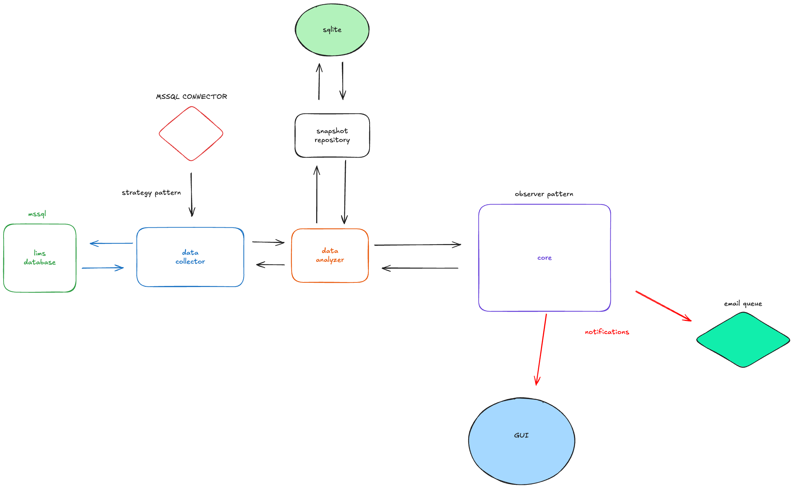

# Atlas - Database Performance Analysis Tool



## Overview

Atlas is a database performance monitoring and analysis tool designed to help database administrators and developers optimize SQL Server performance. It collects, analyzes, and visualizes performance metrics to identify bottlenecks and problematic queries.

## Features

- Real-time monitoring of SQL Server performance metrics
- Historical data analysis and trend visualization
- Query performance tracking and optimization suggestions
- Interactive dashboard with customizable views
- Export performance data for further analysis

## Installation

### Prerequisites

- Python 3.6+
- SQL Server with appropriate permissions
- ODBC Driver for SQL Server

### Install ODBC Driver

#### Windows
- Download and install the Microsoft ODBC Driver for SQL Server from the [Microsoft Download Center](https://docs.microsoft.com/en-us/sql/connect/odbc/download-odbc-driver-for-sql-server)

#### macOS
```bash
brew install unixodbc
brew tap microsoft/mssql-release https://github.com/Microsoft/homebrew-mssql-release
brew update
brew install microsoft/mssql-release/msodbcsql17
```

#### Linux (Ubuntu)
```bash
curl https://packages.microsoft.com/keys/microsoft.asc | apt-key add -
curl https://packages.microsoft.com/config/ubuntu/$(lsb_release -rs)/prod.list > /etc/apt/sources.list.d/mssql-release.list
sudo apt-get update
sudo apt-get install -y unixodbc-dev
sudo ACCEPT_EULA=Y apt-get install -y msodbcsql17
```

### Setup

1. Clone the repository:
   ```bash
   git clone https://github.com/yourusername/atlas.git
   cd atlas
   ```

2. Create and activate a virtual environment:
   ```bash
   python -m venv .venv
   source .venv/bin/activate  # On Windows: .venv\Scripts\activate
   ```

3. Install dependencies:
   ```bash
   pip install -r requirements.txt
   ```

4. Create a `.env` file with your database configuration:
   ```
   # SQL Server connection settings
   DB_HOST=your_server_name
   USERNAME=your_username
   PASSWORD=your_password
   PORT=1433
   DATABASE=your_database_name
   
   # Optional: Specify ODBC driver name if different from default
   ODBC_DRIVER=ODBC Driver 17 for SQL Server
   
   # Performance collection settings
   COLLECTION_LAPSE=60
   ```

## Usage

Run the application with GUI (default):
```bash
python main.py
```

Run in command-line mode (without GUI):
```bash
python main.py --nogui
```

## Troubleshooting

If you encounter issues with the ODBC driver:

1. Check which SQL Server drivers are installed on your system:
   ```python
   import pyodbc
   print(pyodbc.drivers())
   ```

2. Update the `ODBC_DRIVER` value in your `.env` file to match one of the available drivers.

3. Ensure your SQL Server instance accepts remote connections.

## License

[MIT License](LICENSE)